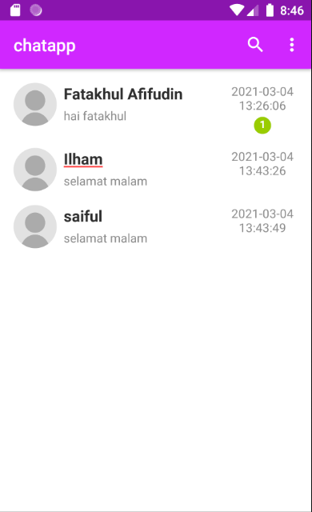
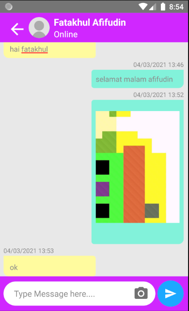
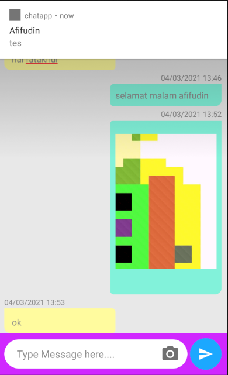

# android_chatapp

For API you can find at [https://github.com/afi11/api_chat_lumen_android](https://github.com/afi11/api_chat_lumen_android)

## Usage Application
> For helping to communicate with another person by text and image using android phone.

## Screenshots

  
  
  

## Application Features
- Login & Reguster User
- Latest message from another user
- Search another user
- Chatroom
- Input message with text and photo
- Online status another user
- User Profil

## Language & Libraries 
- Kotlin (as programming language)
- Android Volley 
- Hdodenhof CircleImageView
- Groupie 
- Squareup Picasso

